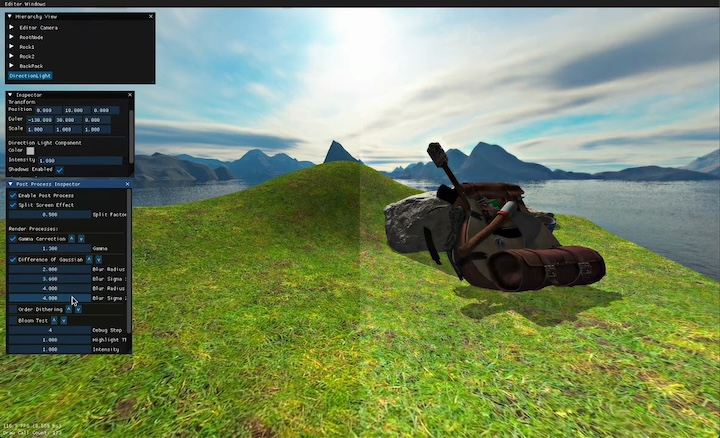

# Michael's Hand Made Game

[](https://www.youtube.com/watch?v=Pfb9lFXOHsQ)
[Youtube Demo Video](https://www.youtube.com/watch?v=Pfb9lFXOHsQ)

A fully custom C++ game engine built from scratch, focusing on rendering, cross-platform builds, and a clean modular architecture.
This project demonstrates my understanding of real-time graphics, engine architecture, and build systems across macOS and Windows.

<!-- Features -->

##### Folder Structure

```
HandMadeGame/
  makefile           # Some command sugar for frequent used cmake command
  CMakeLists.txt
  src/
    engine/          # Core engine stuff
    editor/          # IMGui editor
    game/            # Game specific setting: which scene or model to load
    utils/           # General use utilites
    main.cpp         # Program entry point
  assets/            # Game runtime used image, texture, shader, etc
  external/          # Third party sub repo
  utilites/          # Some external script that help development
  app_packing/       # Mac and windows packing used icon
```

### Depndencies
All dependencies are included as git submodules under external/.
* GLFW
* IMGui
* Assimp

### Build Instructions

**Clone the Repository (recursive with Submodules)**
```
$ git clone --recurse-submodules https://github.com/panmpan17/HandMadeGame.git
```

#### macOS Build
Requirements:
* CMake 3.16
* clang

```bash
$ make build # When the mac application is built, will automatically reveal in Finder
```

####  Windows Build

Requirements:
* Ninja
* make (Optional)

With make
```bash
$ make build # When exe is bult, will automatically reveal in File Explorer
```

Without make
```bash
$ cmake -S . -B ${BUILD_DIR} -DBUILD_APP=ON -DCMAKE_BUILD_TYPE=Release
$ cmake --build ${BUILD_DIR} --parallel <cpu count>
```

<!-- Future Work -->


#### License
MIT License — free for learning, modification, and personal use.
